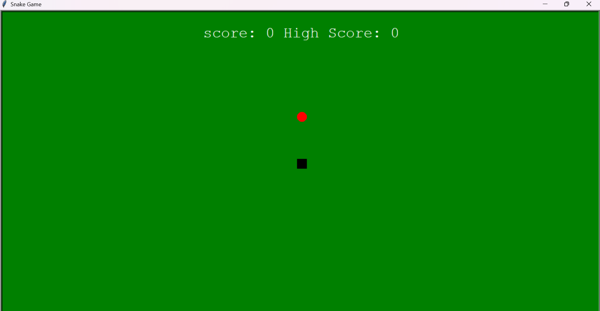

#  Snake Game using Python Turtle

A simple **classic Snake Game** built using Python’s **Turtle Graphics** module.  
This project demonstrates the use of **object movement, collision detection, and score tracking** in a fun and interactive way.

---

##  Game Overview

- The snake moves across the screen using **W, A, S, D** keys.
- Each time the snake eats food (red dot), it grows longer and the **score increases by 10**.
- The game ends if the snake collides with the wall or itself.
- The **high score** is updated automatically during the session.

---

##  Features

 - Built entirely with Python (no external libraries required)  
 - Real-time movement and collision detection  
 - Score and High Score tracking system  
 - Keyboard controls for smooth gameplay  
 - Clean and simple graphical interface  

---

##  Screenshot

---

##  Tech Stack

- **Language:** Python  
- **Library Used:** Turtle  

---

## Conclusion

The Snake Game using Python Turtle is a simple yet engaging project that demonstrates the fundamentals of Python programming and game logic.
It helps build understanding of loops, events, and collision detection while offering a fun, interactive experience.
This project serves as a great starting point for anyone exploring Python graphics and basic game development.

---

## Author

Abir Bhattacharjee
- B.Tech in Computer Science
- Passionate about Software & Game Development

**Connect with me:**  
- [LinkedIn](https://www.linkedin.com/in/abir-bhattacharjee-13386028b)  
- [GitHub](https://github.com/AbirBhatt1999)  
-  Email: [abirbhattacharjee2018@gmail.com](mailto:abirbhattacharjee2018@gmail.com)
